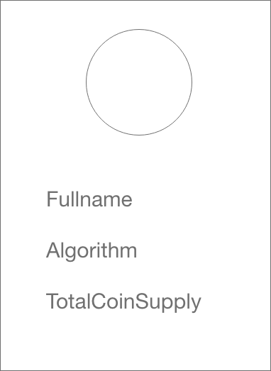

# Angular kickstart!
## Exercises

### Important: 
Before going to the next exercise, make sure your code has been peer reviewed

## 1. Stateless component

The fundamental building block of an Angular application: Components.
Create a stateless aka presentational aka dumb component.

### Wireframe 

1. Make a folder **components** in the **app/** folder
2. Make a folder **coin-info-card** in the **app/components** folder
3. Inside the **app/components/coin-info-card** folder make 3 files:

    - coin-info-card.component.html
    - coin-info-card.component.css
    - coin-info-card.component.ts
    
4. In the **coin-info-card/coin-info-card.component.ts** file make a class and add the Component decorator to it.

    - Import snippet: ``import { Component } from '@angular/core``
    - Define  a selector (+ prefix)
    - Make sure that **coin-info-card.component.css** and **coin-info-card.component.html** are
correctly configured in the component metadata
    - Add the class to the app root module

5. Create the wireframe inside the **coin-info-card.component.html**
Be creative and create your own look and feel. Be free to use a css framework (bootstrap, bulma, material design, tachyons, etc.)

6. Declare the component in **app.component.html**

6. Create a file **coin-info-card/coin-info-card.ts**

7. Create the viewmodel interface for the component inside this file.
    - ``{
      imgUrl: string;
      coinName: string;
      algorithmName: string;
      totalMarketCap: string;
      }``
8. Create a property **model** inside the **coin-info-card.component.ts**. Make sure to provide the correct type and a stub value.

9. Bind the property to the template and make sure the model gets rendered correctly.


## 2. Data binding
 
Import snippets: 

``
import { EventEmitter, Component, Input, Output} from '@angular/core;
`` 

1. Make the model property in your card component an Input binding

2. Add 1 Ouput binding to your card component
    - buttonClick
     
3. Add a button to the template

4. When the use clicks on the button, the output binding should emit a value.

5. Go to **app.component.html**

6. Bind an coin-info-card model to your card component (NOTE: model must declared inside in **app.component.ts**)

7. Add a property clickCount to **app.component.ts**, each time the user clicks on the card icon, clickCount should increment by 1. 
Make sure the clickCount property is being rendered in **app.component.html**


## 3. Directives

1. Make an Array which contains elements of type CoinInfoCard. Add 4 elements.
2. Render all 4 elements as a card component, 
Use the structural directive ngForOf:

- Docs: https://angular.io/api/common/NgForOf

3. Make sure every **even** element in the list has a different back ground color
- Docs: 
https://angular.io/guide/template-syntax#class-binding
https://angular.io/guide/template-syntax#style-binding

## 4. Modules

1. Create a module named "CryptoCompare"
2. Add your card component to the new module, make sure other modules can use the card component.
- make sure to keep your file/folder structure organised
3. Add this module to your app root module.

## 5. Providers

We are going to fetch a cryto coins dictionary from cryptocompare. 
A sample json response looks like this:

```
{
	"Response": "Success",
	"Message": "Coin list succesfully returned!",
	"BaseImageUrl": "https://www.cryptocompare.com",
	"BaseLinkUrl": "https://www.cryptocompare.com",
	"Data": {
		"LTC": {
			"Id": "3808",
			"Url": "/coins/ltc/overview",
			"ImageUrl": "/media/19782/ltc.png",
			"Name": "LTC",
			"CoinName": "Litecoin",
			"FullName": "Litecoin (LTC)",
			"Algorithm": "Scrypt",
			"ProofType": "PoW",
			"SortOrder": "2"
		}
	    ...
	},
	"Type": 100
}
```

1. Map the json of a coin to a typescript interface (use https://transform.now.sh/json-to-ts-interface)
2. Create a service (provider) called CryptoCompareApi and add it to your CryptoCompare module
3. Add a private readonly property BASE_URL
4. Add a private readonly property PATH_COIN_LIST
5. Inject the HttpClient
6. Create a method getCoinList
7. Build the correct url and make a GET request using the HttpClient. 
Map the response data.
8. Inject your new service in the root component
9. In the root component fetch the coin list and assign it to CoinInfoCards

## Masterful exercises

If you have time left, work on the following user stories.
Your teacher will act as product owner and tech lead, so feel free to ask for clarification.

**Remember don't jump to the next story until your code has been reviewed**

// TODO

## Inhuman exercises

If you reached this far, you are truly a fast learner. Company's will be happy to hire you.

// TODO

## Godlike exercise

// TODO